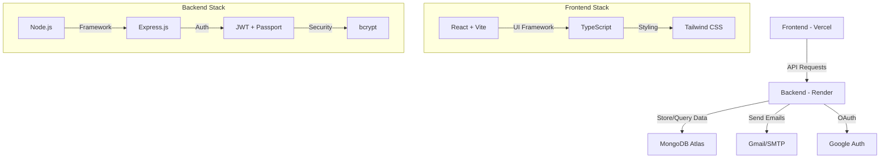
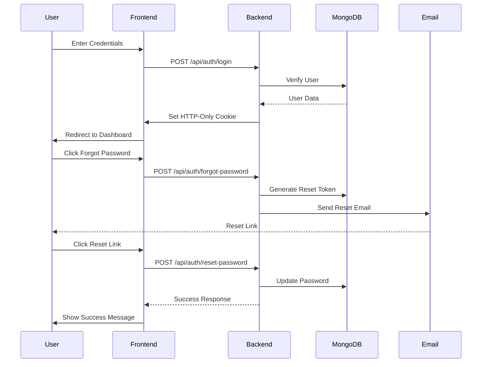
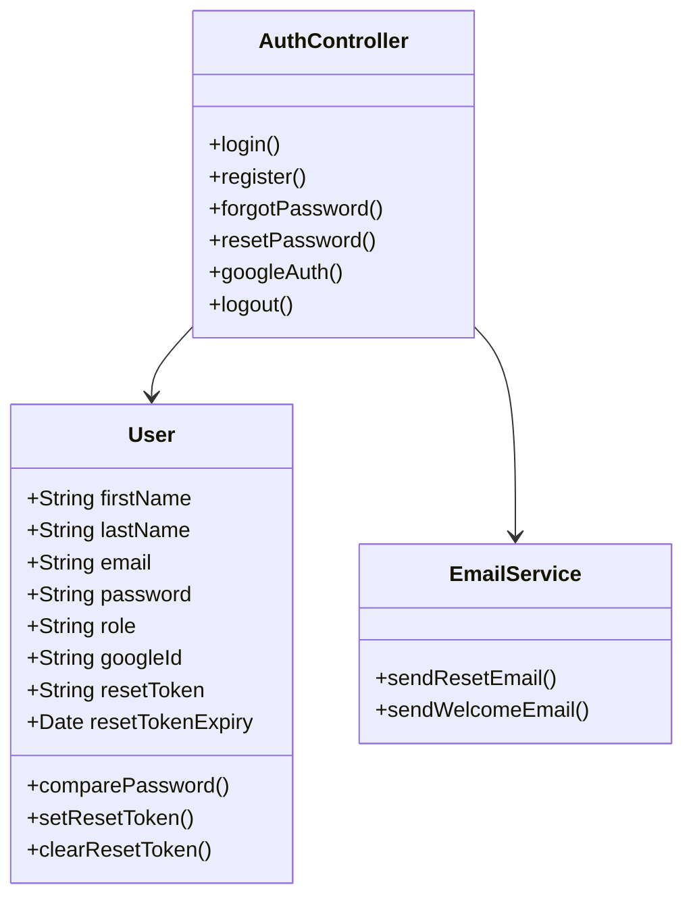

# Veraawell 🚀

A modern, secure authentication platform built with the MERN stack, featuring OAuth integration, password reset functionality, and secure session management.

## System Architecture

### High-Level Overview


### Authentication Flow


### Data Model


## 🛠️ Tech Stack

### Frontend
- **Framework**: React 18 with Vite
- **Language**: TypeScript
- **Styling**: Tailwind CSS
- **Routing**: React Router v6
- **State Management**: React Context + Hooks
- **Build Tool**: Vite
- **Deployment**: Vercel

### Backend
- **Runtime**: Node.js
- **Framework**: Express.js
- **Database**: MongoDB with Mongoose
- **Authentication**: 
  - JWT (HttpOnly cookies)
  - Passport.js
  - Google OAuth 2.0
- **Email**: Nodemailer with SMTP
- **Deployment**: Render.com

## 🔒 Security Features

1. **Password Security**
   - Bcrypt hashing with salt rounds
   - Password strength validation
   - Secure password reset flow

2. **Session Management**
   - HttpOnly cookies
   - Secure session handling
   - CSRF protection

3. **OAuth Integration**
   - Google OAuth 2.0
   - State parameter validation
   - Secure callback handling

4. **API Security**
   - CORS configuration
   - Rate limiting
   - Input validation

## 📧 Email Configuration

### Gmail Setup
1. Enable 2FA on your Gmail account
2. Generate App Password:
   - Go to Google Account settings
   - Security → 2-Step Verification → App passwords
   - Select "Mail" and name it "Veraawell"
   - Copy the 16-character password

### Environment Variables
```env
# Email Configuration
EMAIL_USER=your-gmail@gmail.com
EMAIL_PASS=your-16-character-app-password

# Auth Configuration
JWT_SECRET=your-jwt-secret
SESSION_SECRET=your-session-secret

# OAuth Configuration
GOOGLE_CLIENT_ID=your-google-client-id
GOOGLE_CLIENT_SECRET=your-google-client-secret

# Database
MONGO_URI=your-mongodb-uri
```

### Alternative Email Services
```javascript
// SendGrid Configuration
const transporter = nodemailer.createTransporter({
  host: 'smtp.sendgrid.net',
  port: 587,
  auth: {
    user: 'apikey',
    pass: process.env.SENDGRID_API_KEY
  }
});

// Mailgun Configuration
const transporter = nodemailer.createTransporter({
  host: 'smtp.mailgun.org',
  port: 587,
  auth: {
    user: process.env.MAILGUN_USER,
    pass: process.env.MAILGUN_PASS
  }
});
```

## 🚀 Getting Started

1. **Clone and Install**
   ```bash
   git clone https://github.com/your-username/veraawell.git
   cd veraawell
   ```

2. **Setup Frontend**
   ```bash
   cd client
   npm install
   cp .env.example .env
   ```

3. **Setup Backend**
   ```bash
   cd server
   npm install
   cp .env.example .env
   ```

4. **Configure Environment**
   - Set up all environment variables
   - Configure MongoDB connection
   - Set up email service
   - Configure OAuth credentials

5. **Run Development Servers**
   ```bash
   # Terminal 1 - Frontend
   cd client && npm run dev

   # Terminal 2 - Backend
   cd server && npm run dev
   ```

## 🌐 Deployment

### Frontend (Vercel)
1. Connect your GitHub repository
2. Configure build settings:
   - Framework Preset: Vite
   - Build Command: `npm run build`
   - Output Directory: `dist`
3. Add environment variables
4. Deploy!

### Backend (Render)
1. Create a new Web Service
2. Connect your repository
3. Configure:
   - Environment: Node
   - Build Command: `npm install`
   - Start Command: `npm start`
4. Add environment variables
5. Deploy!

## 🧪 Testing

### Manual Test Cases
- [ ] Regular authentication flow
- [ ] Google OAuth flow
- [ ] Password reset flow
- [ ] Session persistence
- [ ] Error handling
- [ ] Input validation
- [ ] Mobile responsiveness

### Security Checklist
- [ ] HTTPS enforced
- [ ] Secure cookies
- [ ] XSS protection
- [ ] CSRF protection
- [ ] Rate limiting
- [ ] Input sanitization

## 🔜 Roadmap

1. **Short Term**
   - Add email verification
   - Implement rate limiting
   - Add user profiles

2. **Medium Term**
   - Add more OAuth providers
   - Implement 2FA
   - Add audit logging

3. **Long Term**
   - Add admin dashboard
   - Implement role-based access
   - Add analytics

## 📝 License

MIT License - see [LICENSE](LICENSE) for details

---

**Made with ❤️ by Abhigyan Raj and the Veraawell team.** 