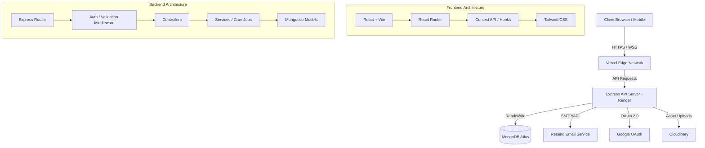
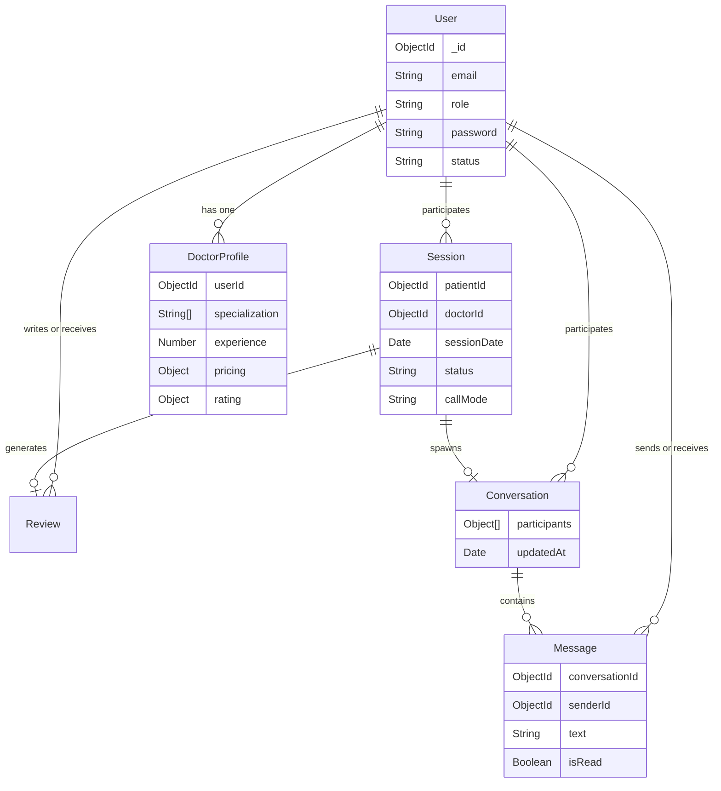
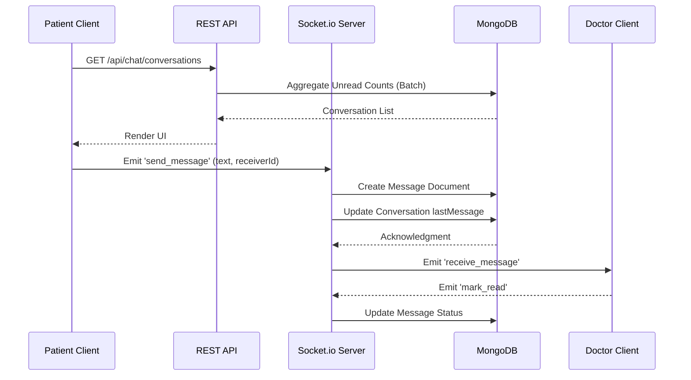
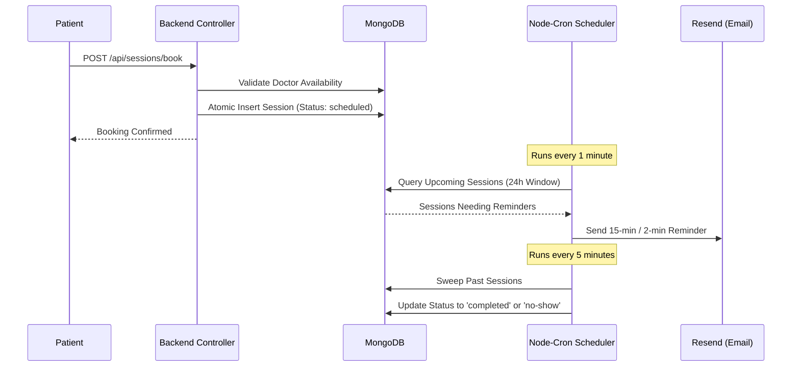

# Veraawell

A modern, secure mental health platform built with the MERN stack. Veraawell provides a safe, scalable, and confidential environment for mental health professionals and patients to connect. It features robust authentication, optimized scheduling, and secure communication channels.

## Technical Overview

Our platform leverages cutting-edge technologies to ensure security, privacy, scalability, and a seamless user experience.

- **Authentication & Security**: JWT-based session management, Google OAuth integration, and strict rate-limiting policies.
- **Role-Based Access**: Specialized secure portals for mental health professionals (doctors) and patients.
- **Real-time Communication**: WebSocket (Socket.io) integration for instant messaging and WebRTC for secure video/audio sessions.
- **Data Integrity & Privacy**: Robust database schemas, input sanitization, and strict access controls.
- **Scalable Architecture**: Highly optimized MERN stack designed for single-instance high concurrency (engineered to handle up to 100k DAU efficiently).

---

## High-Level Design (HLD)

### System Architecture

The Veraawell system follows a robust client-server architecture with external service integrations for specialized tasks.


```mermaid
graph TD
    Client[Client Browser / Mobile] -->|HTTPS / WSS| CDN[Vercel Edge Network]
    CDN -->|API Requests| API[Express API Server - Render]
    
    API -->|Read/Write| DB[(MongoDB Atlas)]
    API -->|SMTP/API| Email[Resend Email Service]
    API -->|OAuth 2.0| Auth[Google OAuth]
    API -->|Asset Uploads| CDN2[Cloudinary]
    
    subgraph Frontend Architecture
    UI[React + Vite] --> Router[React Router]
    Router --> State[Context API / Hooks]
    State --> Styling[Tailwind CSS]
    end
    
    subgraph Backend Architecture
    Route[Express Router] --> Middle[Auth / Validation Middleware]
    Middle --> Controller[Controllers]
    Controller --> Service[Services / Cron Jobs]
    Service --> Model[Mongoose Models]
    end
```

### Component Architecture
1. **Presentation Layer (Frontend)**: A Single Page Application (SPA) built with React and TypeScript. It manages state locally and communicates with the backend via RESTful APIs and WebSockets.
2. **Application Layer (Backend)**: An Express.js Node server adhering to the MVC (Model-View-Controller) pattern. It handles business logic, real-time socket connections, and scheduled cron jobs.
3. **Data Layer (Database)**: A MongoDB NoSQL database hosted on Atlas, utilizing compound indexes and optimized aggregation pipelines for fast data retrieval.
4. **External Services**: 
   - **Resend**: Transactional email delivery (OTPs, session reminders).
   - **Cloudinary**: Profile picture and banner asset management.
   - **Google Cloud**: OAuth 2.0 authentication.

---

## Low-Level Design (LLD)

### Database Schema & Entity Relationship

The data layer is highly relational despite being a NoSQL database, utilizing ObjectIds for referencing.


```mermaid
erDiagram
    User ||--o{ Session : "participates"
    User ||--o{ DoctorProfile : "has one"
    User ||--o{ Review : "writes or receives"
    User ||--o{ Message : "sends or receives"
    User ||--o{ Conversation : "participates"
    
    Conversation ||--o{ Message : contains
    Session ||--o| Conversation : spawns
    Session ||--o| Review : generates
    
    User {
        ObjectId _id
        String email
        String role
        String password
        String status
    }
    
    DoctorProfile {
        ObjectId userId
        String[] specialization
        Number experience
        Object pricing
        Object rating
    }
    
    Session {
        ObjectId patientId
        ObjectId doctorId
        Date sessionDate
        String status
        String callMode
    }
    
    Conversation {
        Object[] participants
        Date updatedAt
    }
    
    Message {
        ObjectId conversationId
        ObjectId senderId
        String text
        Boolean isRead
    }
```

### Core Business Flows

#### 1. Real-Time Chat & Messaging Flow

```mermaid
sequenceDiagram
    participant P as Patient Client
    participant API as REST API
    participant WSS as Socket.io Server
    participant DB as MongoDB
    participant D as Doctor Client

    P->>API: GET /api/chat/conversations
    API->>DB: Aggregate Unread Counts (Batch)
    DB-->>API: Conversation List
    API-->>P: Render UI

    P->>WSS: Emit 'send_message' (text, receiverId)
    WSS->>DB: Create Message Document
    WSS->>DB: Update Conversation lastMessage
    DB-->>WSS: Acknowledgment
    WSS->>D: Emit 'receive_message'
    D-->>WSS: Emit 'mark_read'
    WSS->>DB: Update Message Status
```

#### 2. Session Booking & Synchronization

```mermaid
sequenceDiagram
    participant U as Patient
    participant API as Backend Controller
    participant DB as MongoDB
    participant Cron as Node-Cron Scheduler
    participant E as Resend (Email)

    U->>API: POST /api/sessions/book
    API->>DB: Validate Doctor Availability
    API->>DB: Atomic Insert Session (Status: scheduled)
    API-->>U: Booking Confirmed

    Note over Cron: Runs every 1 minute
    Cron->>DB: Query Upcoming Sessions (24h Window)
    DB-->>Cron: Sessions Needing Reminders
    Cron->>E: Send 15-min / 2-min Reminder
    
    Note over Cron: Runs every 5 minutes
    Cron->>DB: Sweep Past Sessions
    Cron->>DB: Update Status to 'completed' or 'no-show'
```

### Backend Optimizations
- **N+1 Query Elimination**: Heavy endpoints (like Chat unread counts and Therapist lists) utilize single aggregation pipelines and batch queries to process data in O(1) database calls rather than O(N).
- **Decoupled Schedulers**: Session status sweeping and email notifications are handled by background `node-cron` workers, removing blocking I/O from client-facing REST endpoints.
- **Connection Pooling**: MongoDB connection pool max size is configured to handle high concurrency.
- **Index Optimization**: Extensive use of compound indexes for fast reads and sorts on frequently accessed collections.
- **Security Hardening**: Body parsers limited to 1MB to prevent DoS attacks. Strict error suppression on auth endpoints (e.g., password resets) prevents user enumeration. Cascade deletion is implemented to ensure data integrity.

---

## Tech Stack

### Frontend
- **Core**: React 18, TypeScript, Vite
- **Styling**: Tailwind CSS
- **Routing**: React Router v6
- **State Management**: React Context, Custom Hooks
- **Video/Audio**: WebRTC implementation
- **Deployment**: Vercel

### Backend
- **Core**: Node.js, Express.js
- **Database**: MongoDB (Mongoose ODM)
- **Real-Time**: Socket.io
- **Security**: JWT, bcrypt, Helmet, express-rate-limit, express-mongo-sanitize
- **Services**: Resend (Emails), Cloudinary (Images)
- **Deployment**: Render

---

## Environment Variables Configuration

Create a `.env` file in both `client` and `server` directories.

### Server (`server/.env`)
```env
# Server
PORT=5000
NODE_ENV=development
FRONTEND_URL=http://localhost:5173

# Database
MONGO_URI=your-mongodb-atlas-uri

# Authentication
JWT_SECRET=your-secure-jwt-secret
SESSION_SECRET=your-secure-session-secret
ADMIN_JWT_SECRET=your-secure-admin-secret

# OAuth Integrations
GOOGLE_CLIENT_ID=your-google-client-id
GOOGLE_CLIENT_SECRET=your-google-client-secret

# External Services
RESEND=your-resend-api-key
CLOUDINARY_CLOUD_NAME=your-cloud-name
CLOUDINARY_API_KEY=your-api-key
CLOUDINARY_API_SECRET=your-api-secret
```

### Client (`client/.env`)
```env
VITE_API_URL=http://localhost:5000/api
VITE_SOCKET_URL=http://localhost:5000
```

---

## Getting Started

1. **Clone the repository**
   ```bash
   git clone https://github.com/your-username/veraawell.git
   cd veraawell
   ```

2. **Install Dependencies**
   ```bash
   # Install backend dependencies
   cd server
   npm install

   # Install frontend dependencies
   cd ../client
   npm install
   ```

3. **Start Development Servers**
   ```bash
   # In the server directory
   npm run dev

   # In the client directory (new terminal)
   npm run dev
   ```

---

**Developed for high availability and secure mental health care delivery.**